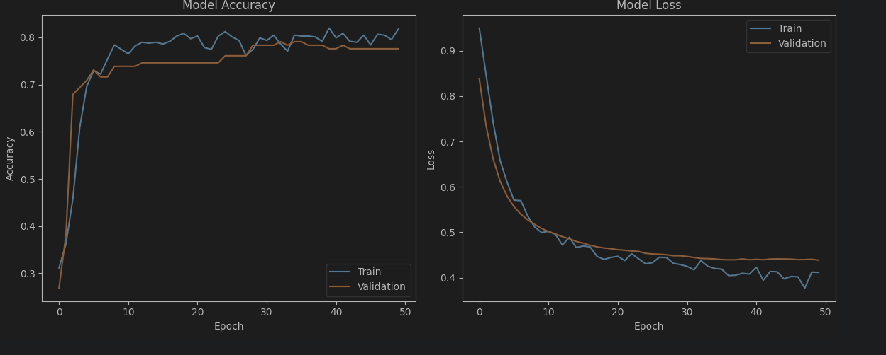
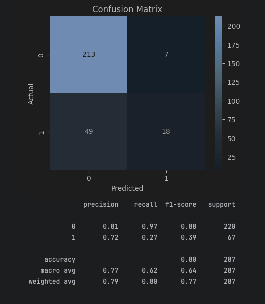

# ✈️ Travel Company Customer Churn Prediction

A neural network project built with **TensorFlow/Keras** to predict whether a travel company customer is likely to churn.

## 📊 Dataset

* 954 customer records
* Demographic and behavioral features
* Binary target (Stay vs Churn)

## 🧠 Model Architecture

* Dense(16, ReLU)
* Dropout(0.2)
* Dense(8, ReLU)
* Dropout(0.2)
* Dense(1, Sigmoid)

## 📈 Results

* Test Accuracy: **(put your accuracy here)**
* Binary Classification Problem
* Evaluated with Confusion Matrix and Classification Report

## Training Performance



## Confusion Matrix



## 🛠️ Tech Stack

* Python
* TensorFlow / Keras
* Pandas
* Scikit-learn
* Matplotlib
* Seaborn

## 🚀 Run Locally

```bash
pip install -r requirements.txt
jupyter notebook
```

Open `travel_churn_prediction.ipynb` and run all cells.

## 📌 Key Business Insight

Frequent flyer behavior, hotel booking activity, and service usage patterns were among the strongest indicators of customer retention in the travel industry dataset.
